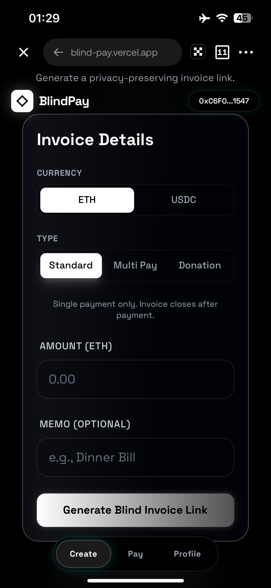
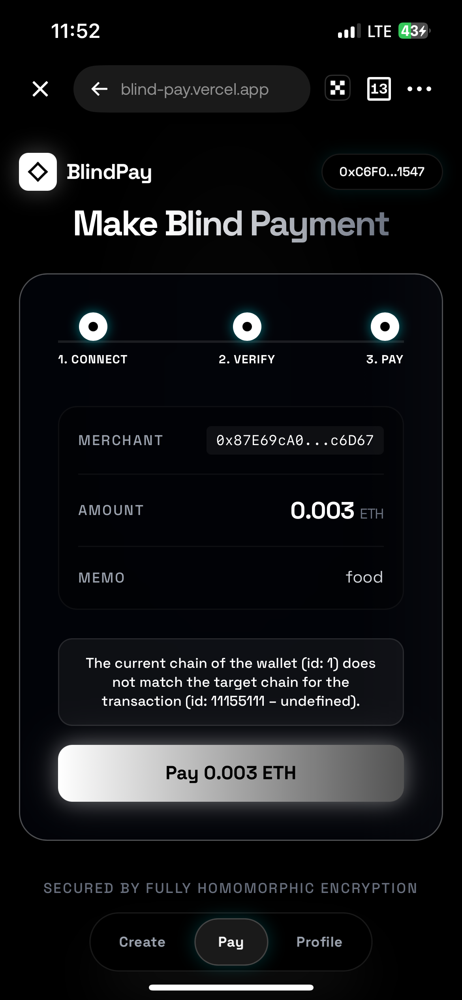
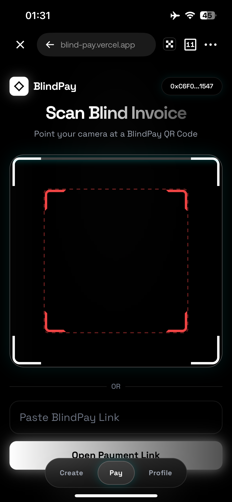
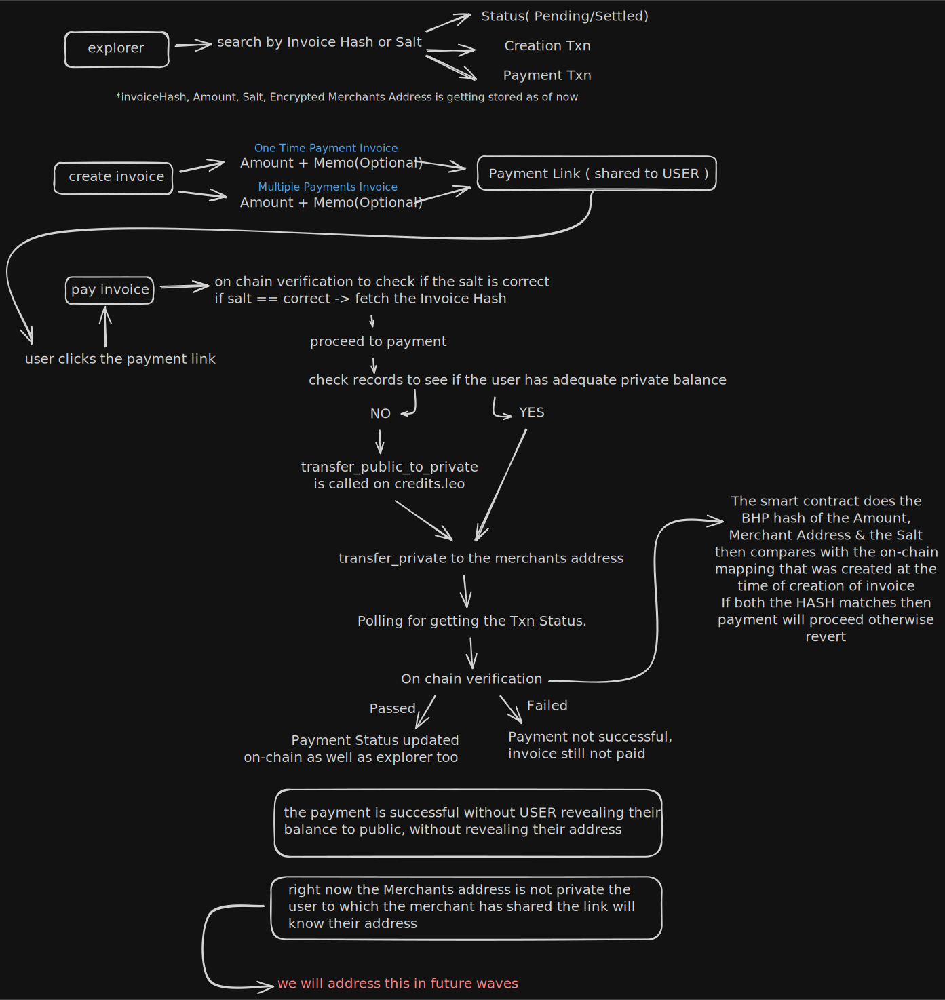
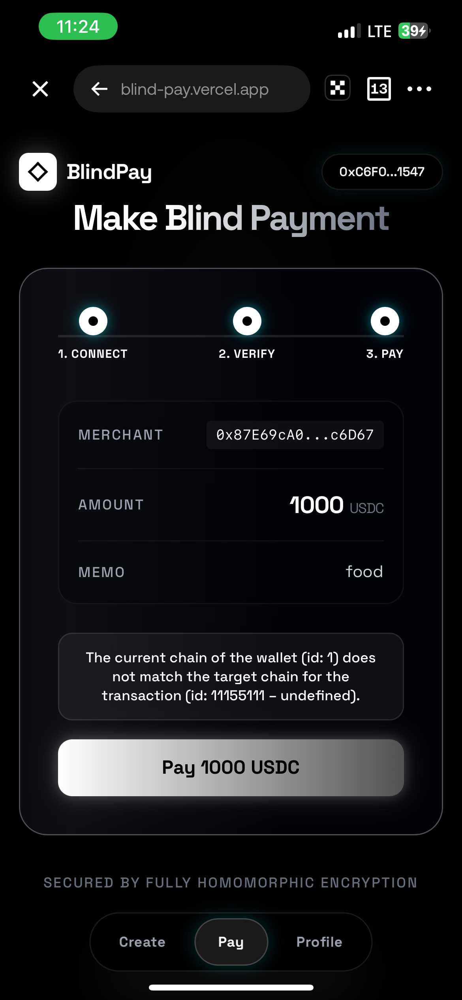

# BlindPay

**Privacy-first payment protocol built on Zama fhEVM with Fully Homomorphic Encryption**

BlindPay is a decentralized invoice and payment system leveraging Zama's fhEVM to enable confidential, verifiable transactions on EVM. Merchants create invoices without revealing sensitive information on-chain — amounts, addresses, and payment status are all FHE-encrypted. Payers settle invoices while keeping everything confidential end-to-end.

<p align="center">
  
  &nbsp;&nbsp;
  
  &nbsp;&nbsp;
  
</p>

**Smart Contract:** `BlindPay.sol` (Sepolia fhEVM)
**Encryption:** Zama TFHE — `euint64`, `eaddress`, `ebool`

---

## Features

### Core Capabilities

- **FHE-Encrypted Invoices** — Invoice amounts stored as `euint64` and merchant addresses as `eaddress` on-chain. No plaintext values ever touch the blockchain.
- **Encrypted Payments** — Payment amounts are FHE-encrypted client-side before submission. The contract operates on ciphertexts atomically.
- **Commitment-Based Claims** — Merchants claim funds via `keccak256(merchant, salt, claimSecret)` — a trustless commitment scheme requiring no on-chain address reveal.
- **Privacy-Preserving Events** — Contract events emit only `salt` identifiers and receipt hashes. No addresses, no amounts.
- **Multi-Token Support** — ETH (native) and USDC (ERC-20) with full privacy guarantees for both.
- **Three Invoice Types** — Standard (single-pay, closes after payment), Multi Pay (campaign-style, multiple contributors), Donation (open-ended, variable amounts).
- **On-Chain Receipts** — Unique receipt hashes generated from `keccak256(salt, timestamp, paymentCount)` for verifiable proof of payment.
- **Blind Database** — Off-chain merchant addresses encrypted with AES-256-GCM. Amounts and memos are never stored in the backend.

### User Experience

- **Wallet Integration** — MetaMask and injected wallets via wagmi v2 with automatic chain switching to Sepolia.
- **Invoice Explorer** — Real-time tracking of invoice status and transaction history.
- **Merchant Dashboard** — Track created invoices, payment counts, claim status, and settlement history.
- **Receipt Verification** — On-chain verification of payment receipts via `verifyReceipt()`.
- **Test Faucet** — Built-in MockUSDC faucet for testnet development.
- **Responsive Design** — Desktop and mobile-optimized interfaces with glassmorphism UI and Framer Motion animations.

---

## Architecture

<p align="center">
  
</p>

BlindPay consists of three layers:

### Layer 1: Smart Contract (Solidity + Zama TFHE)

The on-chain protocol enforces:

- FHE encryption of all sensitive fields (`euint64` amounts, `eaddress` merchants/payers, `ebool` status)
- Commitment scheme for fund claiming (`claimHash` verification)
- Funds held in contract until merchant claims (escrow pattern)
- Reentrancy protection via OpenZeppelin `ReentrancyGuard`
- Receipt tracking for multi-pay invoices

### Layer 2: Frontend (React + TypeScript)

The client-side application handles:

- FHE encryption via `@zama-fhe/relayer-sdk` (WASM-based)
- Salt and claim secret generation using `crypto.getRandomValues()` (256-bit entropy)
- Wallet connection and chain management via wagmi v2
- Invoice link generation with URL parameters
- Transaction submission and receipt tracking

### Layer 3: Backend (Node.js + SQLite)

The indexer and database layer provides:

- Fast invoice lookups without repeated blockchain queries
- AES-256-GCM encrypted storage for merchant addresses
- RESTful API for frontend data access
- Invoice status aggregation across on-chain and off-chain sources

### Data Flow

```
Merchant                                          Payer
   │                                                │
   ├─ Generate salt + claimSecret                   │
   ├─ FHE.encrypt(amount) → euint64                 │
   ├─ FHE.encrypt(address) → eaddress               │
   ├─ Compute claimHash                             │
   ├─ createInvoice() → tx on-chain                 │
   ├─ Save to backend (AES-encrypted)               │
   ├─ Generate payment link ──────────────────────► │
   │                                                ├─ Verify invoice on-chain
   │                                                ├─ FHE.encrypt(payAmount)
   │                                                ├─ payInvoice() → funds held
   │                                                ├─ Receipt hash emitted
   │                                                │
   ├─ claimFunds(salt, claimSecret) ◄────────────── │
   ├─ Funds released to merchant                    │
   └─                                              └─
```

---

## Smart Contract

The core contract `BlindPay.sol` is built on Zama's fhEVM with OpenZeppelin security primitives.

### Data Structures

```solidity
struct Invoice {
    eaddress encMerchant;   // FHE-encrypted merchant address
    euint64  encAmount;     // FHE-encrypted amount (6-decimal)
    eaddress encPayer;      // FHE-encrypted payer (set on payment)
    ebool    isPaid;        // FHE-encrypted status
    uint8    tokenType;     // 0=ETH, 1=USDC (plaintext, needed for control flow)
    uint8    invoiceType;   // 0=standard, 1=multipay, 2=donation (plaintext)
    uint256  paymentCount;  // counter (plaintext, used as status proxy)
}
```

### Functions

#### `createInvoice`

Creates a new FHE-encrypted invoice.

| Parameter | Type | Description |
|-----------|------|-------------|
| `encAmount` | `externalEuint64` | FHE-encrypted invoice amount |
| `inputProofAmount` | `bytes` | ZKPoK proof for the encrypted amount |
| `encMerchantExt` | `externalEaddress` | FHE-encrypted merchant address |
| `inputProofMerchant` | `bytes` | ZKPoK proof for the encrypted merchant |
| `salt` | `bytes32` | Unique invoice identifier |
| `claimHash` | `bytes32` | `keccak256(merchant, salt, claimSecret)` |
| `invoiceType` | `uint8` | 0=standard, 1=multipay, 2=donation |
| `tokenType` | `uint8` | 0=ETH, 1=USDC |

**On-chain storage:** `invoices[salt]` with all encrypted fields + `claimHashes[salt]` for the commitment.

**ACL:** Contract and creator are granted decrypt permissions on all encrypted handles.

#### `payInvoice`

Pays an existing invoice. Funds are held in the contract until the merchant claims.

| Parameter | Type | Description |
|-----------|------|-------------|
| `salt` | `bytes32` | Invoice identifier |
| `encPayAmount` | `externalEuint64` | FHE-encrypted payment amount |
| `inputProof` | `bytes` | ZKPoK proof for the encrypted amount |
| `usdcAmount` | `uint256` | Plaintext USDC amount for `transferFrom` (ETH uses `msg.value`) |

**Behavior:**
- **Standard (type 0):** Accepts one payment, sets `isPaid = true`
- **Multi Pay (type 1):** Accepts multiple payments, invoice stays open
- **Donation (type 2):** Accepts one variable-amount payment

**Security:** Reentrancy guard, payment count check, receipt hash generation.

#### `claimFunds`

Merchant claims held funds using the commitment scheme.

| Parameter | Type | Description |
|-----------|------|-------------|
| `salt` | `bytes32` | Invoice identifier |
| `claimSecret` | `bytes32` | Secret generated at invoice creation |

**Verification:** `keccak256(msg.sender, salt, claimSecret) == claimHashes[salt]`

No on-chain address comparison needed — the hash proves merchant identity without revealing the address.

#### View Functions

| Function | Returns | Description |
|----------|---------|-------------|
| `getInvoice(salt)` | `(tokenType, invoiceType, paymentCount, hasBeenCreated)` | Non-sensitive invoice metadata |
| `verifyReceipt(receiptHash)` | `bool` | Check if a payment receipt exists on-chain |
| `invoiceCount(address)` | `uint256` | Per-merchant invoice counter |

### Events

```solidity
event InvoiceCreated(bytes32 indexed salt);
event PaymentMade(bytes32 indexed salt, bytes32 receiptHash);
event FundsClaimed(bytes32 indexed salt);
```

All events are privacy-preserving — no addresses or amounts are emitted.

---

## Technology Stack

**Blockchain:**
- Ethereum Sepolia Testnet (fhEVM-enabled)
- Solidity 0.8.24 with Zama TFHE library
- OpenZeppelin Contracts (Ownable, ReentrancyGuard, SafeERC20)
- Hardhat + fhEVM plugin

**Frontend:**
- React 18 + TypeScript + Vite
- Tailwind CSS + Framer Motion
- wagmi v2 + viem (EVM wallet integration)
- @zama-fhe/relayer-sdk (FHE encryption in-browser via WASM)
- @tanstack/react-query (data fetching)
- react-router-dom (routing)
- qrcode.react (QR code generation)

**Backend:**
- Node.js + Express
- better-sqlite3 (local database)
- AES-256-GCM encryption (merchant address storage)
- CORS-enabled REST API

---

## Getting Started

### Prerequisites

- Node.js 18+
- MetaMask or any EVM-compatible wallet (on Sepolia)
- Git

### Installation

**1. Clone the repository:**
```bash
git clone https://github.com/Jemiiah/BlindPay.git
cd BlindPay
```

**2. Install dependencies:**
```bash
# Frontend
cd frontend && npm install

# Backend
cd ../backend && npm install

# Contracts (optional, for development)
cd ../contracts && npm install
```

### Environment Setup

**Frontend** (`frontend/.env`):
```
VITE_API_URL=http://localhost:3000/api
VITE_CONTRACT_ADDRESS=0xYourDeployedBlindPayAddress
VITE_USDC_ADDRESS=0xYourDeployedMockUSDCAddress
VITE_RPC_URL=https://ethereum-sepolia-rpc.publicnode.com
VITE_EXPLORER_URL=https://sepolia.etherscan.io
```

**Backend** (`backend/.env`):
```
ENCRYPTION_KEY=your_64_char_hex_key
PORT=3000
```

**Generate an encryption key:**
```bash
node -e "console.log(require('crypto').randomBytes(32).toString('hex'))"
```

**Contracts** (`contracts/.env`):
```
RPC_URL=https://ethereum-sepolia-rpc.publicnode.com
PRIVATE_KEY=your_deployment_private_key
```

### Running

**Start the backend:**
```bash
cd backend
npm run dev
```

**Start the frontend:**
```bash
cd frontend
npm run dev
```

The application will be available at `http://localhost:5173`.

### Deploying Contracts

```bash
cd contracts
npx hardhat compile
npx hardhat run scripts/deploy.ts --network sepolia
```

---

## Project Structure

```
BlindPay/
├── contracts/                         # Solidity smart contracts
│   ├── contracts/
│   │   ├── BlindPay.sol               # Main fhEVM contract (V2)
│   │   └── MockUSDC.sol               # Test ERC-20 token
│   ├── scripts/
│   │   └── deploy.ts                  # Deployment script
│   ├── test/                          # Contract tests
│   └── hardhat.config.ts              # Hardhat + fhEVM config
│
├── frontend/                          # React + TypeScript + Vite
│   ├── src/
│   │   ├── abi/                       # Contract ABIs (BlindPay, MockUSDC)
│   │   ├── components/
│   │   │   ├── invoice/               # InvoiceForm, InvoiceCard
│   │   │   ├── profile/               # InvoiceTable, StatsCards, Modals
│   │   │   └── ui/                    # Button, GlassCard, ConnectButton, etc.
│   │   ├── desktop/                   # Desktop app shell + pages
│   │   │   └── pages/                 # Create, Pay, Explorer, Faucet, Docs, etc.
│   │   ├── mobile/                    # Mobile-optimized app shell + pages
│   │   ├── hooks/
│   │   │   ├── WalletProvider.tsx      # Wagmi config + React Query
│   │   │   ├── useWallet.ts           # Connection, chain switching
│   │   │   ├── useCreateInvoice.ts    # Invoice creation workflow
│   │   │   ├── usePayment.ts          # Payment processing
│   │   │   ├── useClaimFunds.ts       # Merchant fund claiming
│   │   │   └── useTransactions.ts     # Invoice data fetching
│   │   ├── utils/
│   │   │   ├── fhe.ts                 # FHE encryption (amount + address)
│   │   │   └── evm-utils.ts           # Hashing, parsing, formatting
│   │   ├── services/
│   │   │   └── api.ts                 # Backend API client
│   │   ├── types/
│   │   │   ├── invoice.ts             # Invoice interfaces
│   │   │   └── relayer-sdk.d.ts       # Zama SDK type declarations
│   │   └── App.tsx                    # Responsive desktop/mobile router
│   └── vite.config.ts                 # WASM + COOP/COEP headers
│
├── backend/                           # Node.js + Express API
│   ├── index.js                       # API routes
│   ├── db.js                          # SQLite setup
│   ├── encryption.js                  # AES-256-GCM encrypt/decrypt
│   └── db_schema.sql                  # Database schema
│
└── README.md
```

---

## Frontend Pages

| Route | Page | Description |
|-------|------|-------------|
| `/` | Explorer | Invoice search and discovery |
| `/create` | Create Invoice | Generate FHE-encrypted invoices |
| `/pay` | Payment | Process payments via invoice link |
| `/profile` | Dashboard | Merchant invoice management and claims |
| `/faucet` | Faucet | Mint test USDC tokens |
| `/verify` | Verification | On-chain receipt verification |
| `/docs` | Documentation | Technical documentation |
| `/vision` | Vision | Project overview and roadmap |
| `/privacy` | Privacy | Privacy policy and encryption details |

**Mobile:** Renders an optimized subset (`/`, `/create`, `/pay`, `/profile`) with bottom navigation.

---

## FHE Encryption Flow

BlindPay uses the `@zama-fhe/relayer-sdk` to encrypt values client-side before they reach the blockchain.

```
Client (Browser)                    fhEVM (On-Chain)
      │                                    │
      ├─ initSDK()                         │
      ├─ createInstance(SepoliaConfig)      │
      │                                    │
      ├─ createEncryptedInput(contract,     │
      │    signer)                         │
      ├─ input.add64(amount)               │
      │   OR input.addAddress(addr)        │
      ├─ input.encrypt()                   │
      │   → { handles[], inputProof }      │
      │                                    │
      ├─ writeContract(handles, proof) ──► │
      │                                    ├─ FHE.fromExternal(handle, proof)
      │                                    ├─ FHE.allowThis(ciphertext)
      │                                    ├─ Operate on ciphertexts
      │                                    └─ Store encrypted state
```

**Encrypted types used:**
- `euint64` — Invoice and payment amounts (6-decimal format)
- `eaddress` — Merchant and payer addresses
- `ebool` — Payment status

---

## Backend API

**Base URL:** `http://localhost:3000`

| Method | Endpoint | Description |
|--------|----------|-------------|
| `GET` | `/api/invoices` | List invoices (optional: `?status=PENDING&limit=50&merchant=0x...`) |
| `GET` | `/api/invoices/recent` | Recent invoices (`?limit=10`) |
| `GET` | `/api/invoices/merchant/:address` | Invoices by merchant address |
| `GET` | `/api/invoice/:hash` | Single invoice by hash/salt |
| `POST` | `/api/invoices` | Create invoice record |
| `PATCH` | `/api/invoices/:hash` | Update invoice status |

### POST `/api/invoices`

```json
{
  "invoice_hash": "0x...",
  "merchant_address": "0x...",
  "status": "PENDING",
  "salt": "0x...",
  "invoice_type": 0,
  "invoice_transaction_id": "0x..."
}
```

`merchant_address` is encrypted with AES-256-GCM before storage (`IV:TAG:CIPHERTEXT` format).

### PATCH `/api/invoices/:hash`

```json
{
  "status": "SETTLED",
  "payment_tx_ids": ["0x..."],
  "block_settled": 12345
}
```

---

## How It Works

### 1. Merchant Creates Invoice

<p align="center">
  
</p>

- Client generates random `salt` (bytes32) and `claimSecret` (bytes32)
- Computes `claimHash = keccak256(merchant, salt, claimSecret)`
- FHE-encrypts amount (`euint64`) and merchant address (`eaddress`) in-browser
- Submits `createInvoice()` transaction with encrypted values + commitment hash
- Saves encrypted metadata to backend, generates shareable payment link

### 2. Payer Receives Link

<p align="center">
  
</p>

- Payment link contains: `merchant`, `amount`, `salt`, `memo`, `type`, `token`
- Frontend verifies invoice exists on-chain via `getInvoice(salt)`
- Checks payment status (already paid for standard invoices)

### 3. Payment Executed

<p align="center">
  
  &nbsp;&nbsp;&nbsp;
  
</p>

- Payer FHE-encrypts payment amount client-side
- For USDC: approves contract spend, then calls `payInvoice()`
- For ETH: sends value with `payInvoice()`, contract converts 6-decimal to 18-decimal wei
- Contract holds funds in escrow, emits `PaymentMade` event with receipt hash

### 4. Merchant Claims Funds

- Merchant calls `claimFunds(salt, claimSecret)` with the secret from step 1
- Contract verifies `keccak256(msg.sender, salt, claimSecret) == claimHash`
- Funds released to merchant (ETH via `call`, USDC via `safeTransfer`)

---

## Security Model

### What's Encrypted

| Data | On-Chain | Off-Chain (DB) |
|------|----------|----------------|
| Invoice amount | `euint64` (FHE) | Not stored |
| Merchant address | `eaddress` (FHE) | AES-256-GCM |
| Payer address | `eaddress` (FHE) | Not stored |
| Payment status | `ebool` (FHE) | Plaintext (PENDING/SETTLED) |
| Salt | Plaintext (identifier) | Plaintext |
| Token/invoice type | Plaintext (control flow) | Plaintext |

### What's Visible

- `salt` identifiers in events
- Receipt hashes in events
- `paymentCount` (number of payments, not amounts)
- `tokenType` and `invoiceType` (needed for contract logic branching)
- USDC `Transfer` events (ERC-20 standard limitation)
- ETH `msg.value` (inherent to native transfers)

### Contract Security

- **ReentrancyGuard** on `payInvoice` and `claimFunds`
- **Checks-Effects-Interactions** pattern throughout
- **SafeERC20** for token transfers
- **Commitment scheme** for trustless fund claiming (no on-chain address comparison)
- **ACL permissions** — only contract and creator can operate on encrypted handles

---

## Built With

- [Zama fhEVM](https://docs.zama.ai/fhevm) — Fully Homomorphic Encryption on EVM
- [OpenZeppelin](https://docs.openzeppelin.com/contracts) — Battle-tested Solidity libraries
- [wagmi](https://wagmi.sh) — React hooks for EVM wallets
- [viem](https://viem.sh) — TypeScript EVM interface
- [Hardhat](https://hardhat.org) — Ethereum development framework
- [Vite](https://vite.dev) — Frontend build tool
- [Tailwind CSS](https://tailwindcss.com) — Utility-first CSS
- [Framer Motion](https://motion.dev) — Animation library
